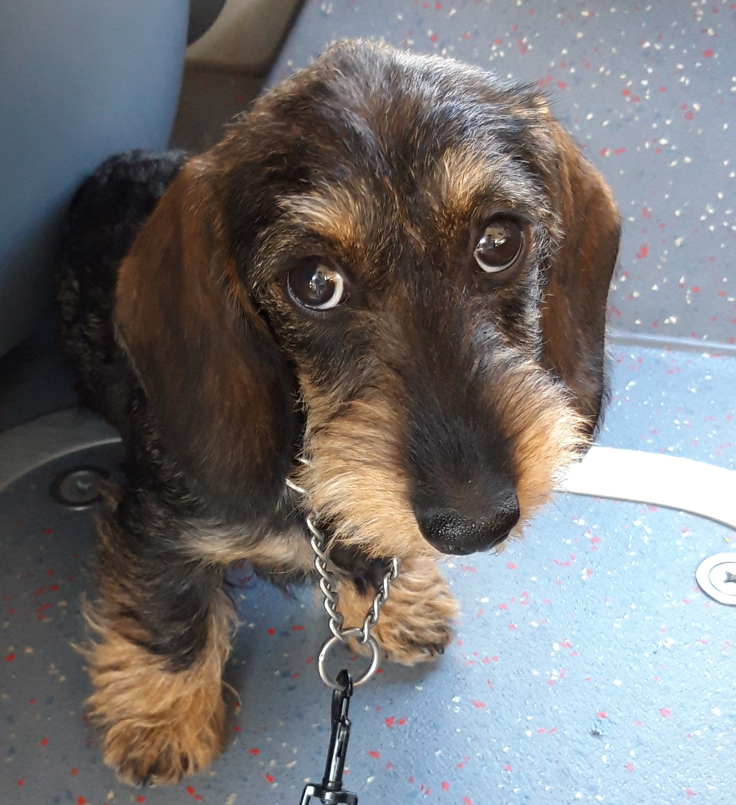
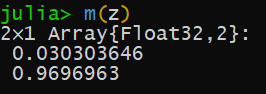

# Cats & Dogs Classification

This code was created  for training Neural Network to classify dogs and cats.
Data was taken from this [kaggle task.](https://www.kaggle.com/chetankv/dogs-cats-images)

To create and train neural network I used Flux.jl package and to speed up process of training I used CUDA.jl for gpu computing.

This code isn't long so all of it is in main.jl file.

# Why Julia ?

I'm a Data Science student and I worked with R and python.
I read about Julia and wanted to check it for myself.

# How accurate is my network?

To see how well it works I tested accuracy on 1000 labeled pictures that this network never seen before.

## Testing Set :

On testing set provided by kaggle I had ≈ 85 % accuracy.

## My own test

Here is how my Neural Network classify my dog Greta :

It output 97% for dog.  I think that's good :)

